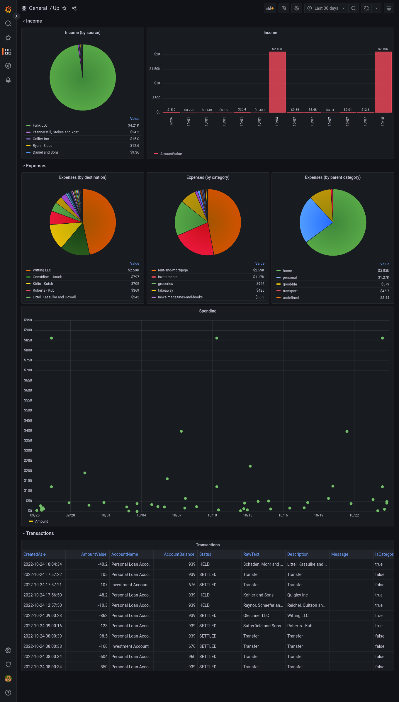

<p align="center">

</p>

# Up Bank Grafana Datasource Plugin

Using the Up API

- Docs: https://developer.up.com.au/
- Repo: https://github.com/up-banking/api




# Try it locally

Generate API from OpenAPI spec
```
yarn build:api
```

Build plugin in dev mode
```
yarn dev
```

Start grafana
```
docker-compose up
```

Navigate to http://localhost:3000 and login with username `admin` and password `admin`

Go to `Settings` -> `Data sources` -> `Add data source`

Scroll to the bottom and select `Up Bank`

Follow the instructions to generate your Personal Access Token for the Up API: https://developer.up.com.au/#getting-started

Click `Save & test`

Click the `Dashboards` tab, and import the sample dashboard

Then go home, and select the new dashboard

More details on local plugins: https://grafana.com/docs/grafana/latest/developers/plugins/development-with-local-grafana/
